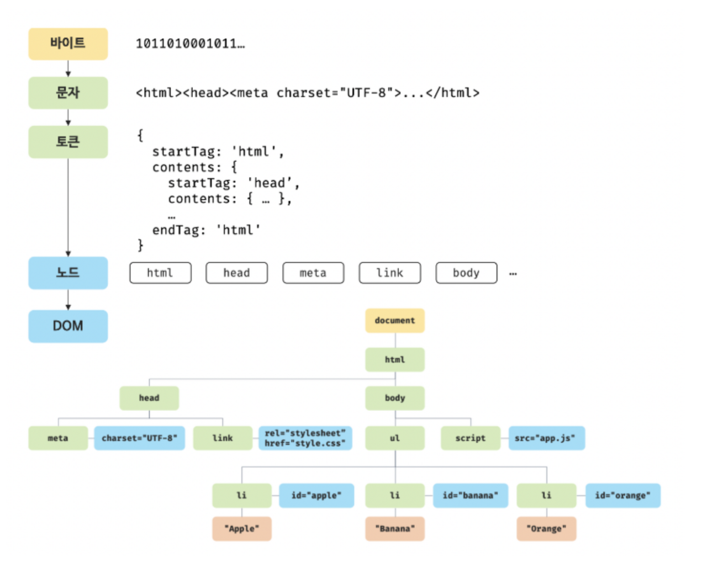
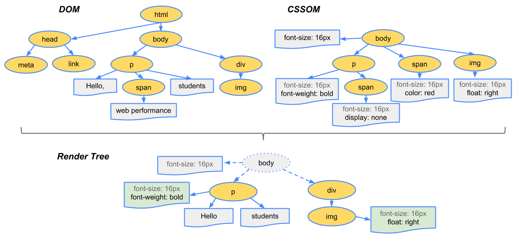
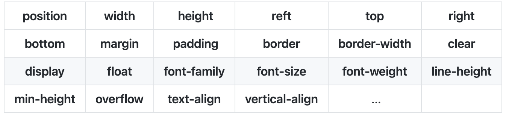
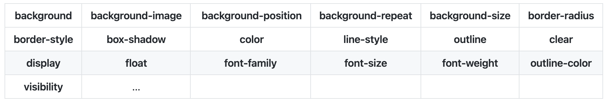

# 브라우저 구조
---
## 1. 사용자 인터페이스(User Interface)
   * 브라우저의 렌더링 화면를 제외한 나머지 GUI부분을 통칭한다.
## 2. 브라우저 엔진(Browser Engine)
   * 사용자 인터페이스와 렌더링 엔진 사이의 동작을 제어
## 3. 렌더링 엔진(Rendering Engine)
   * HTML, CSS 등을 파싱하고 최종적으로 화면에 그려준다.
## 4. 통신(Networking)
   * HTTP 요청과 같은 네트워크 호출에 사용. 보통 플랫폼의 독립적인 인터페이스이고 각 플랫폼의 하부에서 실행된다.
## 5. 자바스크립트 해석기(JavaScript Interpreter)
   1) ### 자바스크립트 엔진
      * 자바스크립트 엔진이라고도 불리며 브라우저마다 전용엔진이 탑재되어 있다. ex)크롬-V8
      * 웹브라우저에서 자바스크립트를 사용하기 위해서 필요하다.

   2) ### 자바스크립트 엔진의 구조
      * 힙 메모리(Heap Memory)
      * 동적 메모리 할당에 사용되는 자료구조이다. (우선순위 큐)
      * V8엔진은 힙에 객체 또는 동적 데이터를 저장한다.

  3) ### 콜 스택
     * 자바스크립트는 싱글 스레드 기반이다.
     * 프로그램 상에서 현재 우리가 어디에 있는지를 나타내는 자료구조이다.
     * 스택 자료구조로 후입선출 형태로 실행된다.
## 6. UI 백엔드
   * 렌더링 엔진이 분석한 Render Tree를 브라우저에 그리는 역할을 담당한다.
  
## 7. 자료 저장소
   * 로컬에 데이터를 저장하기 위해 사용한다.
   * 영구 저장소인 로컬스토리지와 임시 저장소인 세션스토리지가 있다.
   * 이러한 웹스토리지는 origin(도메인 + 프로토콜)마다 하나씩만 존재한다.              

  

# 브라우저 렌더링
---

## 브라우저 렌더링 과정
1. 브라우저를 통해 웹페이지에 접속한다.
2. 서버로부터 HTML, CSS, JavaScript 등의 리소스를 받는다.
3. 렌더링 엔진이 HTML, CSS 파일을 파싱해서 각각 DOM, CSSOM 트리를 구축한다.
4. DOM, CSSOM 트리를 결합해서 Render 트리를 만든다.
5. 렌더링 엔진은 레이아웃 과정을 통해서 각 요소의 위치, 크기를 계산하고 어디에 배치할지를 결정한다.
6. UI백엔드에서 렌더트리를 화면에 그린다. 이것을 Paint라고 한다.

## 파싱(Parsing)
* 프로그래밍 언어로 작성된 파일을 실행시키기 위해 구문분석을 하는 작업이다.
* 바이트코드 -> 문자열 -> 토큰 -> 노드 -> DOM 순으로 변경한다.
* 렌더링 엔진은 HTML파일을 파싱하다가 link,style 태그를 만나면 파싱을 중단하고 서버로부터 CSS파일을 받은 후 파싱한다. CSSOM 트리를 만든 후 HTML파싱의 중단된 부분부터 다시 DOM 트리를 만든다.

### Dom 트리

* DOM은 HTML 각 요소들의 중첩 관계를 기반으로 노드들을 트리 구조로 구성한것이다.
브라우저는 JavaScript만 이해하기 때문에 응답으로 받아온 텍스트로만 구성된 HTML을 이해할 수 있는 형태인 객체로 바꿔준것이 DOM 트리이다.

### CCSOM 트리

### Render 트리

* DOM과 CCSOM은 트리구조라서 비슷하게 생겼지만, 다른 속성을 가진 서로 독립적인 트리이므로 웹사이트에 표시하기 위해서는 합치는 과정이 필요하다.
화면에 렌더링을 하는것이므로 최종적으로 브라우저에 표시되는 노드만 렌더 트리에 포함된다. (display : none, 등은 제외된다.)

  

## 레이아웃
* Render 트리는 요소의 크기, 위치에 관련된 정보가 있다. 하지만 단순히 텍스트로만 된 정보이기에 각 요소들이 화면에 어떻게 나타낼지를 파악할 필요가 있다.
렌더트리를 바탕으로 레이아웃(크기, 위치)를 계산하여 뷰포트안 어디에 배치할지를 결정한다.

  

## Paint
* 레이아웃에서 결정된 대로 실제 화면에 그리는 과정이다.
* 픽셀에 대한 정보들을 바탕으로 픽셀을 채워나간다.

  

## 리플로우(Reflow)와 리페인트(Repaint)

* 화면에 요소가 추가, 삭제 등 변화가 생기면 앞서 보았던 렌더링 과정을 반복하게 된다. ex)JavaScript로 DOM을 조작하는 경우 다시 DOM을 만들고 CSSOM를 합쳐 렌더트리를 만든 후 레이아웃 + 페인트 작업을 반복한다.
다시 레이아웃 작업을 하는것은 리플로우, 다시 페인트 작업을 하는것은 리페인트라 한다.

 

### 리플로우와 리페인트의 최적화
* 사용자의 눈에 부드럽게 처리가 되기 위해선 60프레임을 유지해야한다. (1초당 60장의 화면)
* 브라우저의 과부하로 프레임을 유지하지 못하는 경우 화면이 끊기는것 처럼 느껴진다.
* 따라서 성능 최적화가 필요하게 된다.

> 리플로우가 발생하면 리페인트는 필연적으로 실행된다. 가능하다면 리페인트만 일어나도록 하자.

#### 1) CSS 속성선택으로 최적화

* 리플로우가 일어나는 대표적인 속성

* 리페인트가 일어나는 대표적인 속성

#### 2) 영향을 주는 노드를 줄이는 최적화
* JavaScript + CSS를 조합한 애니메이션이 많거나, 레이아웃 변화가 많은 요소의 경우 position을 absolute, fixed로 주면 영향을 받는 주변 노드들을 줄여줄 수 있다.